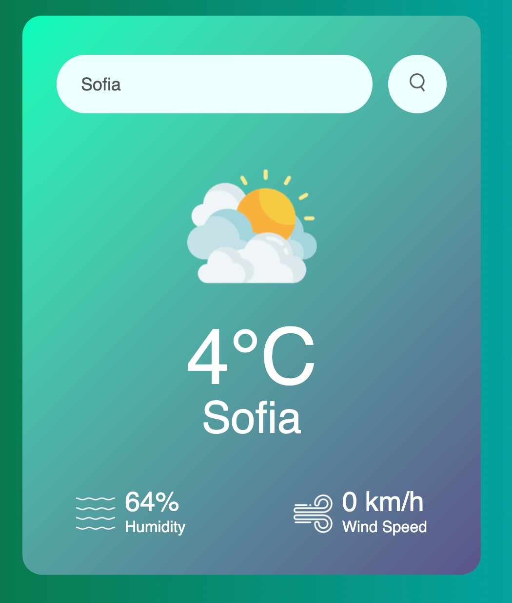
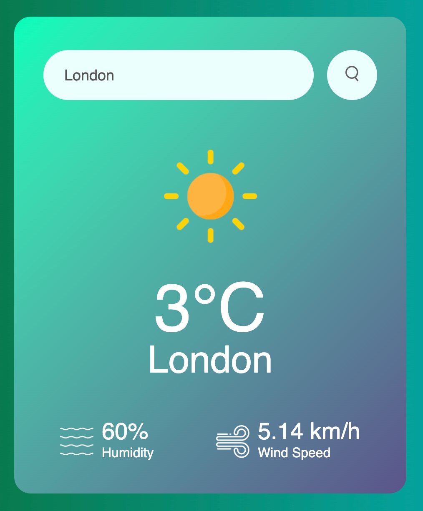

# Weather Application

## Summary:

This is a simple practice HTML/CSS/JS project that dynamically shows the current temperature in a given location by connecting to free API (OpenWeatherMap).

### Main features:

- Simple and compact UI before you enter anything.
- Enter a city to check its weather live now.
- Dynamically update temperature, humidity and wind speed.
- Present in a clean & concise way
- Error handling 

#### Screenshots:

